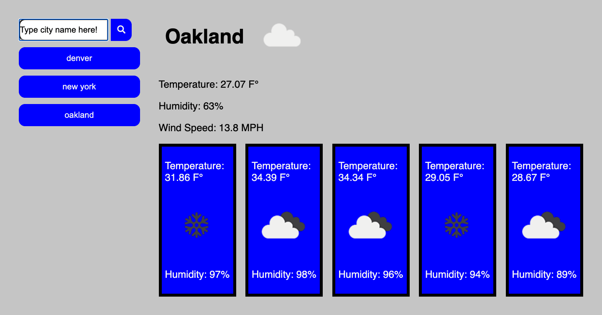

# WeatherDashBoard

## Motivation.
I wanted to test my skills at building a single page application using web APIs and I wanted to get better at dynamically displaying html using Javascript.

## Technologies used
I used the <a href="https://openweathermap.org/api" target="_blank"> opensourceweather web Api</a> for the source of my daily and weekly forecast. HTML was used to create the submit form and to create injection points for my Javascript. CSS was used to create my grid layout, styling, and mobile responsiveness, Javascript was used to execute the function of the application as well as everything you see on the front end, and finally local storage is used to store the users input into an array so we can access the searched cities and their results via clickable buttons even after they close out their web browser.

## Direction for use.

* Click inside of the search bar and type a city name
* Click on the Blue search button
* you will be provided with the current weather as well as the five day forecast for the selected city
* after you search a city, a clickable button is created that accesses that cities current weather forecast
* you may close your browser after searching a city, reopen, click on one of the cities searched, and that cities forecast will display in real time.
* see screenshot of the application above for example.

## What I learned.

I learned so much building this app. How to build my grid with css instead of relying on bootstrap, which gives me a deeper understanding of whats going on with my styling. I really expanded on my ability to use Javascript in displaying HTML. I wrote html inline using Javascript creating elements and classes. I also used for loops to create elements, add classes, and display information for the five day forecast since I required so much information that changes day to day. I learned the power of local storage, how to store and access arrays so the end user can retrieve the information I want accessible to them. 

## Deployed application
https://iigonzoii.github.io/WeatherDashBoard/
