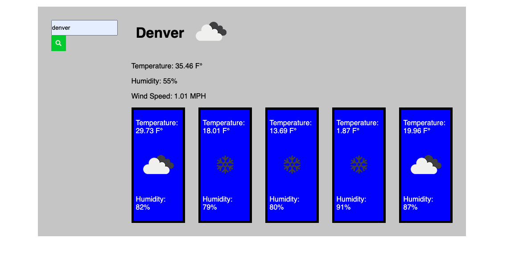

# WeatherDashBoard

## Motivation.
I wanted to test my skills with api fetch and dynamic display of html using javascript

## direction for use.

* Click inside of the search bar and type a city name
* click on the green search button
* you will be provided with the current weather as well as the five day forecast for the selected city

* see screenshot of the application above for example.

once a city is searched you should be able to see your search history displayed under the search bar

## What I learned.

## Deployed application
https://iigonzoii.github.io/WeatherDashBoard/
